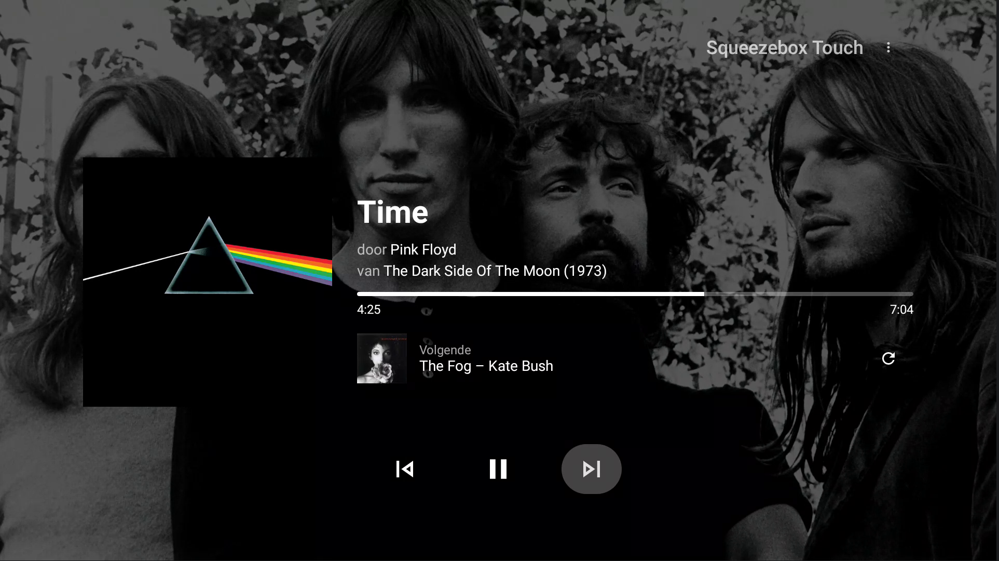

# Logitech Media Server Now Playing
Android TV app to show the current playing song from your Logitech Media Server (Lyrion) instance.

If you have a Jellyfin instance, you can provide the credentials to grab the backdrop image. Otherwise it defaults to showing the album art.

|  | 
|:--:| 
| *Now Playing screen (always falls back to Lyrion's own album art if Jellyfin isn't configured)* |

## Features

- Runtime settings screen — configure your Lyrion (and optional Jellyfin) server directly in the app, no rebuild needed.
- Remembers a default player (checkbox in the player menu) and auto-connects to it on startup, so a Harmony-launched activity is ready to go without picking a player by hand.
- Shows a preview of the next track under the currently playing one.
- "Replace next track" button that picks a new upcoming track: uses the SugarCube plugin's own replace action if available, otherwise a legitimate Don't Stop The Music trigger, and falls back to a random track from the same genre/artist if neither is installed.
- Correct standby/exit handling (via Back press or a Harmony activity's standby button), including waking self-powered or software players like Squeezelite — works great as a Squeezelite companion.
- Resilient to network hiccups: a temporarily unreachable server/player (e.g. one that's still waking up) no longer crashes the app.

# Installing without building

Prebuilt APKs are published on the [Releases page](https://github.com/HB64/lms-nowplaying-fork/releases) — download the `.apk` from the latest release and install it via `adb install` or a file manager/sideload app on your Android TV device. After install, fill in your Lyrion (and optional Jellyfin) server details on the in-app settings screen — no `local.properties` or rebuild required.

# Building the Source
*Project currently builds with Kotlin 2.2.21, AGP 8.1.2, and Jellyfin SDK 1.8.11 (see `gradle/libs.versions.toml`).*

1. Clone the repo and open it in Android Studio.
2. Copy the contents of `sample.local.properties` into a `local.properties` file in the project root (Android Studio creates this file automatically the first time you open the project — just append the settings below to it). This step is optional: it only pre-fills default server credentials at build time. You can leave everything blank (still quoted as `""""`) and configure the server(s) from the in-app settings screen after install instead.
3. Fill in your own values (or leave blank/`""""` to configure at runtime instead):
   - `LMS_URL` / `LMS_USERNAME` / `LMS_PASSWORD` — point this at your Lyrion Music Server (formerly Logitech Media Server / LMS). If your server has no auth configured, still set both to `""""` (four double quotes — empty credentials must be quoted like this or the build fails).
   - `JELLYFIN_URL` / `JELLYFIN_API_KEY` / `JELLYFIN_USERNAME` / `JELLYFIN_PASSWORD` — optional. Used as a fallback to fetch an artist backdrop image when Lyrion has no portrait for the artist. Leave `JELLYFIN_API_KEY` empty (`""""`) to disable Jellyfin entirely — the app then just shows a blurred album cover as the background.
4. Restart Android Studio (or "Sync Project with Gradle Files") so the new `local.properties` values are picked up by the secrets-gradle-plugin.
5. Change the build variant to `release` (or use `debug` while developing).
6. In Android Studio: Build → Generate App Bundles or APKs → Generate APKs.
7. Install the APK on your Android TV device (e.g. Nvidia Shield) via `adb install` or by running it directly from Android Studio with the device selected.

## Jellyfin compatibility — important

The Jellyfin SDK version pinned in `gradle/libs.versions.toml` (`jellyfin-sdk`) must roughly match your Jellyfin **server** version, or authentication and artist-image lookups will fail or crash at runtime. Check your server version in Jellyfin under *Dashboard → General*, then pick a matching SDK release from the [jellyfin-sdk-kotlin releases page](https://github.com/jellyfin/jellyfin-sdk-kotlin/releases) — each release lists its "Recommended API Version". As of this writing, SDK `1.8.11` targets Jellyfin server `10.11.x`.

If you bump the SDK version and hit build or runtime errors, these are the two we've already run into:
- **Runtime crash: `NoClassDefFoundError: org.slf4j.LoggerFactory`** — the SDK logs via `kotlin-logging`, which needs an SLF4J binding on the classpath that isn't pulled in automatically. Fixed by adding `implementation(libs.slf4j.nop)` (a no-op logger) to `app/build.gradle.kts`. Already present in this repo, but worth knowing about if you fork/reset.
- **Compile error: `Unresolved reference 'get'` on `SearchApi`** — newer SDK versions renamed `SearchApi.get(...)` to `SearchApi.getSearchHints(...)` (same parameters). Already updated in `JellyfinApi.kt`.
- Bumping the Jellyfin SDK also generally requires a recent Kotlin version (2.2.x+) and the `org.jetbrains.kotlin.plugin.compose` Gradle plugin instead of the old `composeOptions.kotlinCompilerExtensionVersion` setup — both already configured in this repo.

## Configuration

Server URLs and credentials can be set two ways, and runtime settings always take priority:

- **In-app settings screen** (recommended) — configure or change your Lyrion/Jellyfin servers directly on the device, no rebuild needed. Stored via DataStore.
- **Compile-time defaults** via `local.properties`/`BuildConfig` (see "Building the Source" above) — useful as a fallback default, or if you prefer not to type credentials on a TV remote.
